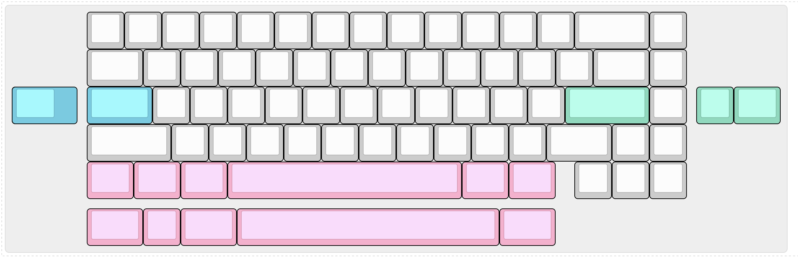
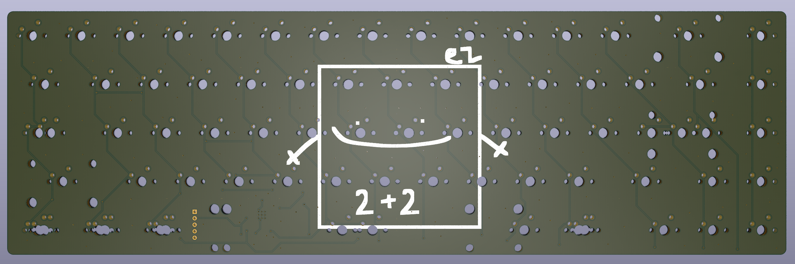
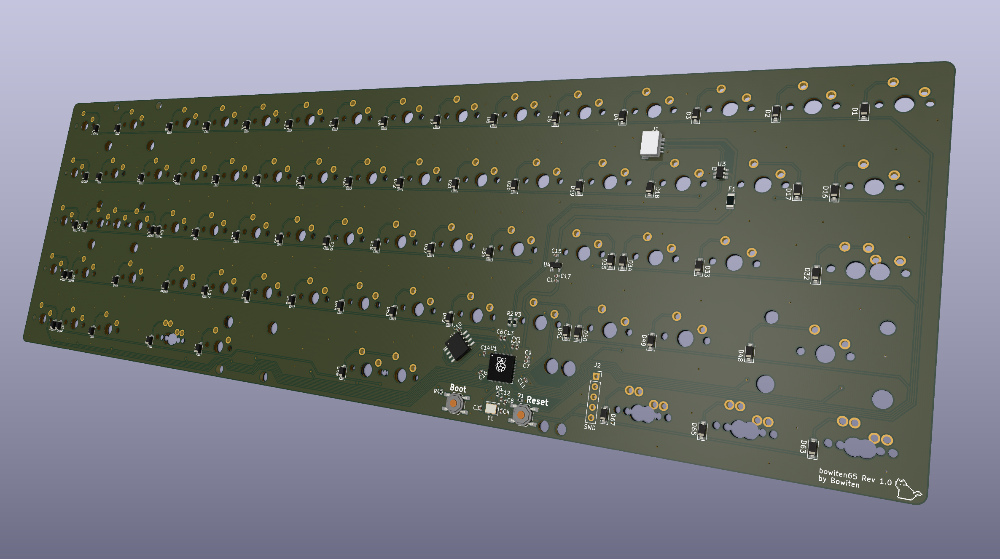

# bowiten65
a 65% keyboard pcb with a jst connector for a [unified daughterboard](https://github.com/Unified-Daughterboard/Unified-Daughterboard)
# layout

# kicad renders

# production
i have sent this to jlcpcb to make, although it hasn't arrived yet, so use at your own risk
